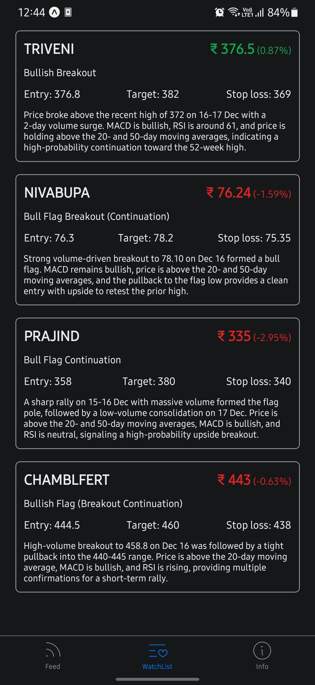
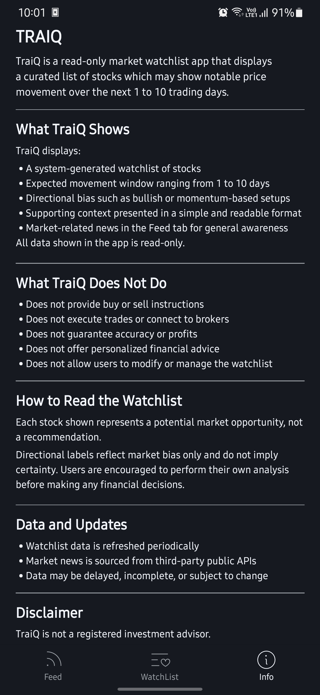

# 📈 TraiQ

**TraiQ** is a clean, read-only market watchlist mobile application that displays a curated list of stocks which may show notable price movement over the next **1 to 10 trading days**.

The app is designed for traders, investors, and market observers who want a **signal-focused, distraction-free view** of potential market opportunities without executing trades or managing portfolios.

---

## 🚀 Why TraiQ Exists

Most trading apps are overloaded with:

- Too many indicators
- Emotional triggers
- Buy/Sell pressure
- Unnecessary actions

TraiQ takes a different approach.

It focuses purely on **visibility of potential market signals**, allowing users to observe, analyze, and decide independently using their own strategies.

---

## ✅ What TraiQ Does

TraiQ focuses on **signal visibility**, not actions.

It:

- Displays a **system-generated watchlist** of stocks
- Highlights stocks that may perform in the **short-term window**
- Shows **directional bias** such as bullish or momentum-based setups
- Presents information in a **simple and readable format**
- Provides **market-related news** for general awareness
- Operates in a **fully read-only mode**

TraiQ does **not**:

- Place trades
- Execute orders
- Provide buy or sell recommendations
- Track user portfolios
- Store personal or financial information

---

## 🧠 How TraiQ Works (High-Level Architecture)

1. Market data is analyzed using a **private AI-powered backend**
2. The backend generates potential stock signals
3. The processed results are uploaded to a database
4. The TraiQ mobile app connects **only to Supabase**
5. The app fetches and displays data in a read-only format

> The AI backend is **not publicly exposed** and has no direct connection to the client app.

This design ensures:

- Security
- Scalability
- Clean separation of concerns

---

## 📱 Application Structure

TraiQ follows a simple and intentional **three-tab layout**:

### 1️⃣ Feed

- Displays market-related news
- Helps users stay aware of overall market sentiment
- No predictions or recommendations

### 2️⃣ Watchlist

- The core screen of the app
- Shows stocks that may show movement in the next 1–10 days
- Generated entirely by the system
- No user actions required

### 3️⃣ Info

- Explains what TraiQ is and what it is not
- Guides users on how to read the data
- Contains important disclaimers
- Displays project and version information
- Provides a link to this GitHub repository

---

## 🖼️ Screenshots

  
  
  

---

## 🎨 Design Philosophy

TraiQ is built with the following principles:

- Minimal UI
- No clutter or noise
- Premium color palette
- Clear and accessible typography
- Optimized for both light and dark modes

---

## 🔐 Privacy & Data Handling

- TraiQ does **not collect personal user data**
- No user behavior tracking
- No storage of financial or sensitive information

---

### Planned Enhancements

- Intraday watchlists
- Long-term trend watchlists
- Improved signal explanations
- Enhanced filtering and categorization
- Performance and UI improvements

---

## ⚠️ Disclaimer

TraiQ is **not a registered investment advisor**.

All information provided by TraiQ is for **educational and informational purposes only**.

Nothing in this application should be considered financial, investment, or trading advice.

Stock market investments are subject to market risk.  
Past performance does not guarantee future results.

Users assume full responsibility for any decisions made based on the information displayed in this app.
